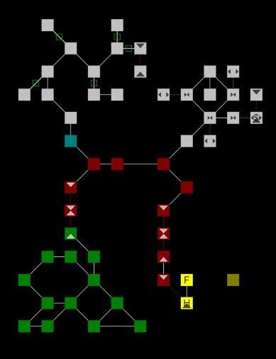

# Mudmapper

Mudmapper is a program which converts ROM 2.4 MUD area files to a format which Mudlet can use to create a map of the mud for users. If you're like me, and you absolutely love ROM 2.4 MUDs (and other supported `.are` file format MUDs/MUSHes/MOOs/etc), and you have access to all the area files, you can generate a map to distribute to your players who use Mudlet.

## Setup

1. `pip install -r requirements.txt`

## Usage

Converts all area files in the folder `area_test` to json format and puts `json` versions in the same directory.`

`python .\convert_are_to_json.py -i area_test -o area_test`

Convert the json files in directory `area_test` to mudlet map format and output `map.xml`:

`python .\convert_json_to_mudlet_xml.py -i area_test -o map.xml`
